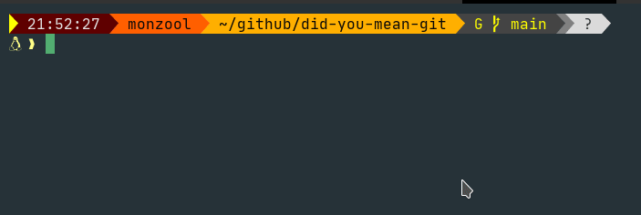
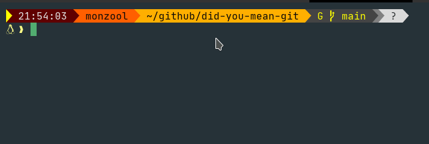
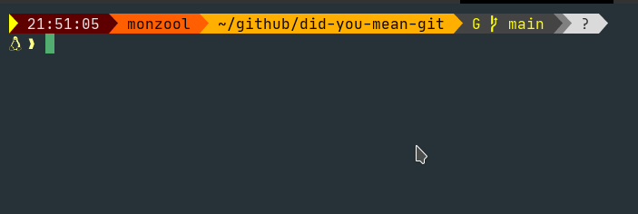

# Did you mean git?

This is a taunting tool for those who, like me, sometimes fumbles up spelling `git`. Instead of helping, this tool just makes it more annoying! 🤦‍♂️


Its a small script that is a continuation of [gti racer](https://github.com/monzool/gti_racer) and utilizes the [command error exit banner](https://github.com/monzool/shell-command-error-exit-banner) tool.


## Installation

1. Clone the repo

2. Make sure scripts are executable

```sh
chmod +x /path/to/did-you-mean-git/*.sh
```

From here you can either 

a) Put `/path/to/did-you-mean-git` in `${PATH}`

or

b) Make some aliases

```bash
alias fit='/path/to/did-you-mean-git/did_you_mean_git.sh fit'
alias got='/path/to/did-you-mean-git/did_you_mean_git.sh got'
alias gti='/path/to/did-you-mean-git/did_you_mean_git.sh gti'
alias gut='/path/to/did-you-mean-git/did_you_mean_git.sh gut'
alias hit='/path/to/did-you-mean-git/did_you_mean_git.sh hit'
```


## Usage


```sh
fit
```




---

```sh
got
```




---

```sh
gti
```


---

```sh
gut
```


---

```sh
hit
```




